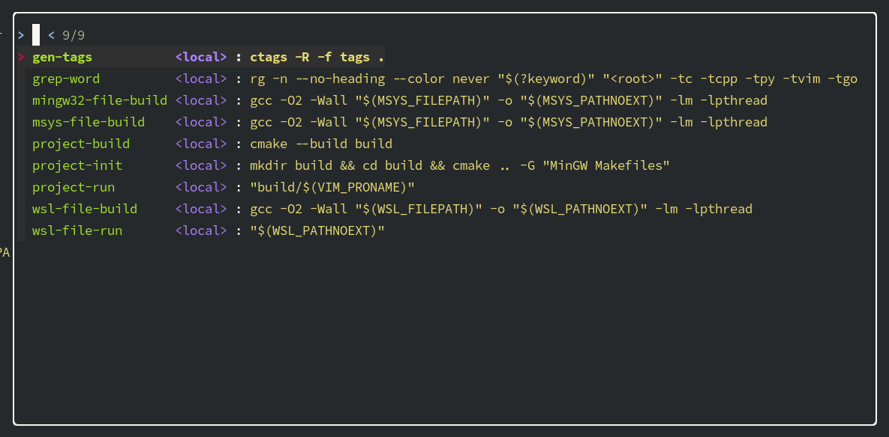

# fzf-lua-asynctasks

[fzf-lua](https://github.com/ibhagwan/fzf-lua) integration for [asynctasks](https://github.com/skywind3000/asynctasks.vim)



## Installation

[fzf-lua](https://github.com/ibhagwan/fzf-lua) and [asynctasks](https://github.com/skywind3000/asynctasks.vim)
should be installed, plese follow their installation instructions.

With packer:
```lua
use {
  'deathmaz/fzf-lua-asynctasks',
  config = function()
    require('fzf-lua-asynctasks').setup({
      -- write fzf-lua config here if needed
    })
  end
}
```

## Usage

```lua
vim.keymap.set('n', '\\t', function()
  fzf_lua.asynctasks()
end, { noremap = true, silent = true })

vim.keymap.set('n', '\\t', '<cmd>FzfLua asynctasks<CR>', { noremap = true, silent = true })
```

or

```
:FzfLua asynctasks
```

## Configuration

Refer to [fzf-lua](https://github.com/ibhagwan/fzf-lua) for configuration explanation

Default configuration:
```lua
{
  actions = {
    ['default'] = require('fzf-lua-asynctasks').default_action
  },
  fzf_opts = {
    ["--no-multi"] = '',
    ["--nth"]      = '1',
  },
  winopts = {
    height = 0.6,
    width = 0.6,
  }
}
```
